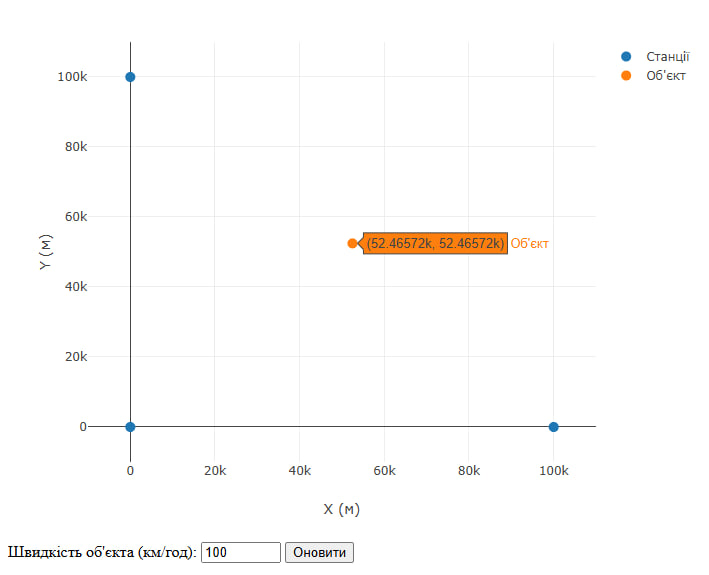

# Звіт з лабораторної роботи №6
## Розробка додатку для візуалізації вимірювань LORAN

### Опис роботи
В ході виконання лабораторної роботи було розроблено веб-додаток для візуалізації даних навігаційної системи LORAN. Програма отримує дані через WebSocket з'єднання та використовує метод найменших квадратів для визначення позиції об'єкта відносно трьох базових станцій.

Основні компоненти системи:
- Візуалізація даних на графіку в декартових координатах
- Відображення позицій базових станцій та об'єкта
- Можливість налаштування швидкості руху об'єкта
- Обчислення позиції об'єкта за різницею часу прибуття сигналів

### Результати тестування

На зображенні представлено роботу системи з наступними параметрами:
- Швидкість руху об'єкта: 100 км/год
- Координати базових станцій:
  * Станція 1: (0, 0)
  * Станція 2: (100000, 0)
  * Станція 3: (0, 100000)
- Поточна позиція об'єкта: (52465.72, 52465.72) метрів

На графіку показано:
- Три базові станції (сині точки) розташовані у вершинах прямокутника
- Об'єкт стеження (помаранчева точка) з відображенням його координат
- Діапазон вимірювання: від -10000 до 110000 метрів по обох осях

### Висновок
Розроблена система успішно виконує функції візуалізації даних LORAN. Реалізований метод найменших квадратів забезпечує точне визначення позиції об'єкта на основі різниці часу прибуття сигналів від базових станцій. Система працює в реальному часі та дозволяє змінювати параметри руху об'єкта для дослідження різних сценаріїв роботи.
